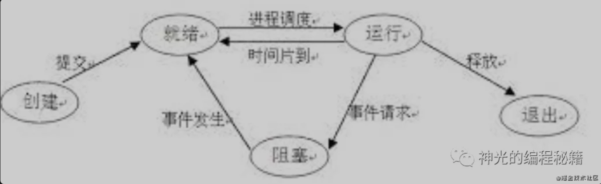
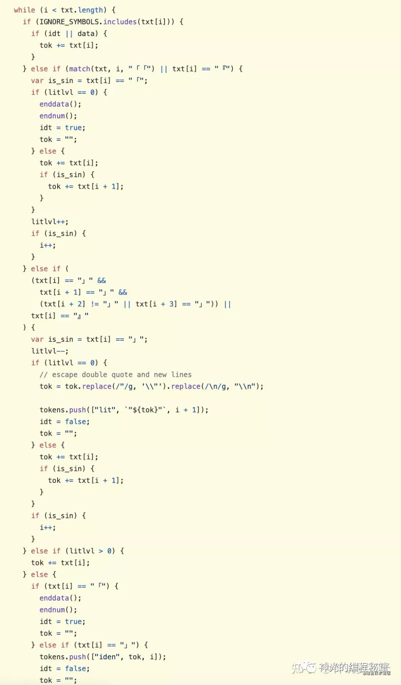
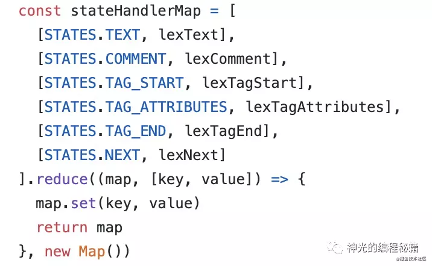
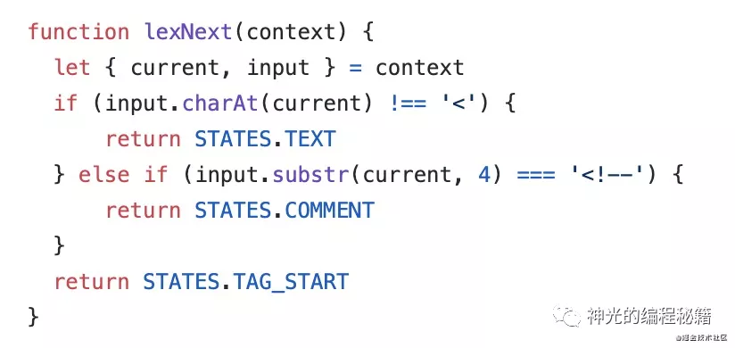
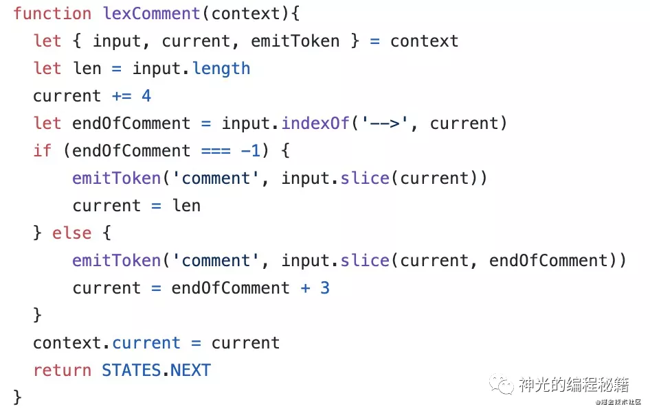
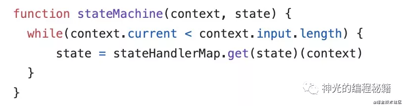
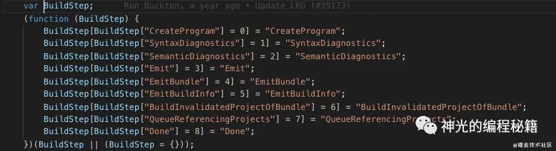
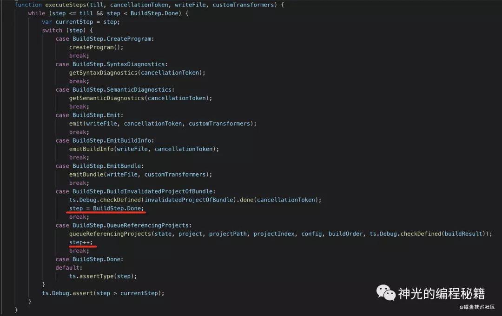

# 如何用状态机简化代码中复杂的 if else 逻辑

[如何用状态机简化代码中复杂的 if else 逻辑](https://mp.weixin.qq.com/s/dDOA5JQQz3r4a7-yPl33Bg)

## 什么是状态机

当处理的情况比较多，把每种情况的处理逻辑封装成一个状态，然后不同情况之间的转换变成状态的转换。这种代码组织形式就是状态机。

当每个状态知道输入某一段内容时转到哪一个状态，在一个循环内自动进行状态的流转和不同状态的处理，这种叫做状态自动机（automation），如果一个状态在一种输入下只有一个后续状态，这种就叫做确定性有限状态自动机（DFA）。
状态之间的流转可以通过状态转换图来表示：


## 业务代码中的状态机

业务代码中当遇到各种 if else 的判断的时候同样可以用状态机来优化。把每种情况封装成一个状态，通过某一种条件触发状态的流转，然后在状态机里面选择不同的状态处理逻辑进行处理。

```javascript
enum XxxState{
    AAA=0,
    BBB,
    CCC,
}
function stateMachine(state:XxxState, payload: any){
    switch(state){
        case XxxState.AAA:
            handleAaa(payload);
            break;
        case XxxState.BBB:
            handleBbb(payload);
            break;
        case XxxState.CCC:
            handleCcc(payload);
            break;
    }
}

```

## 此法分析中的状态机

其实状态机最常用的地方是用于词法分析，因为每个 token 都是一种处理情况，自然会有很多 if else。

像下面这样用 if else 来做分词自然也可以，这是 wenyan 的词法分析逻辑，但是代码很难维护。


更好的做法是使用状态机（DFA）来做分词，把每一种 token 的处理封装成一个状态。通过边界条件的判断来做状态流转，比如某个 wxml parser 分了这些状态：


每种状态处理一种情况的 token 的识别：



通过状态的变化驱动处理逻辑的流转：

这样不断的进行各状态之间的流转，当处理到字符串的末尾的时候，就完成了所有的分词。

## typescript 源码中的状态机

typescript compiler 就是通过状态机来组织整个编译流程的。
首先 tsc 划分了很多状态，每种状态处理一种逻辑。比如：

- CreateProgram 把源码 parse 成 ast
- SyntaxDiagnostics 处理语法错误
- SemanticDiagnostics 处理语义错误
- Emit 生成目标代码



typescript 就通过这种状态的修改来完成不同处理逻辑的流转，如果处理到结束状态就代表流程结束。



这样使得整体流程可以很轻易的扩展和修改，比如想扩展一个阶段，只要增加一个状态，想修改某种状态的处理逻辑，只需要修改下状态机的该状态的转向。而不是大量的 if else 混杂在一起，难以扩展和修改。

可以看到，状态机使得 typescript 的编译步骤可以灵活的扩展和修改。

## 总结

首先明确了状态机的概念：通过不同状态封装不同情况的处理逻辑，通过状态的修改来完成处理逻辑之间的流转。

如果每种状态都知道下一个状态是什么，在一个循环内自动完成状态流转的状态机，就是状态自动机，当状态为有限个时，就是有限状态自动机（DFA）。

业务代码中也经常会有不同情况做不同的处理，这些情况在一定的条件时会做转换的场景，比如类似开始、暂停、结束、重新开始这种。这种代码就很适合用状态机来优化，不然会有很多的 if else。

词法分析中一般会使用有限状态自动机（DFA）来处理，不同 token 用不同的状态来处理，通过输入字符的不同来做状态的流转，处理完字符串就完成了分词。

typescript compiler 就是通过状态自动机来进行处理，封装了很多个状态，每个状态知道下一个状态是什么，直到处理到终止状态，就结束编译。

总之，当逻辑可以划分为不同的情况，各种情况之间会相互转换的时候就可以用状态机来优化，能够免去大量的 if else，并且代码的可读性、可扩展性、可维护性都会有一个很大的提升。
