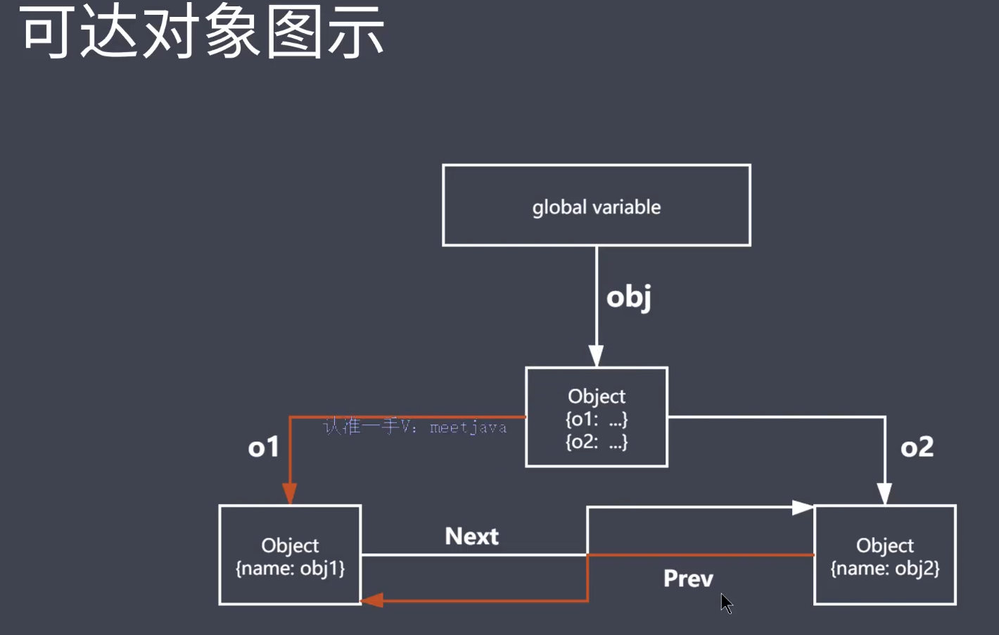
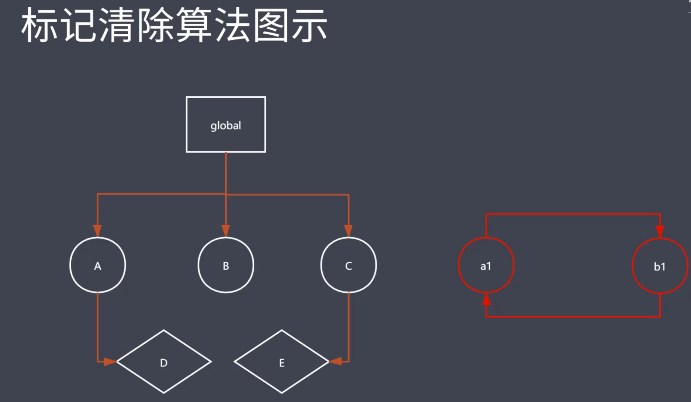
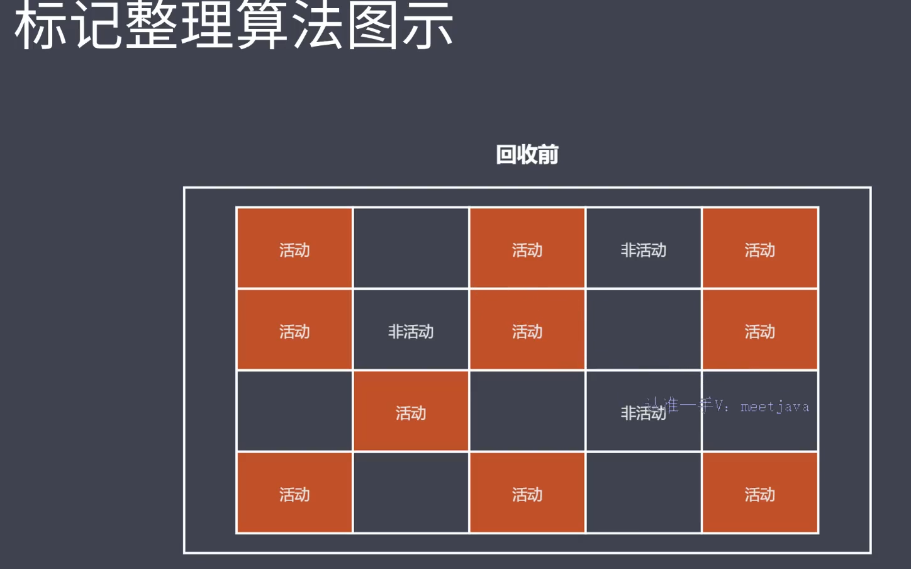
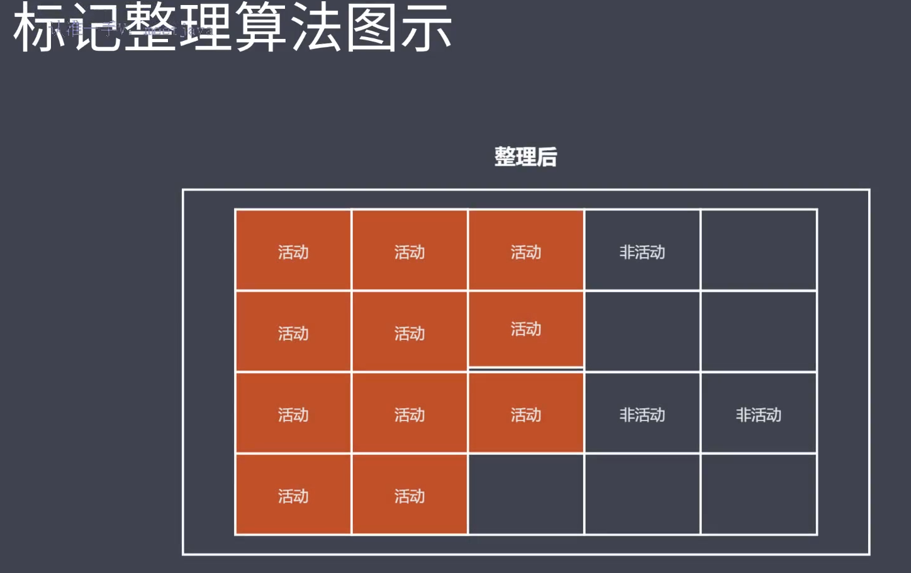
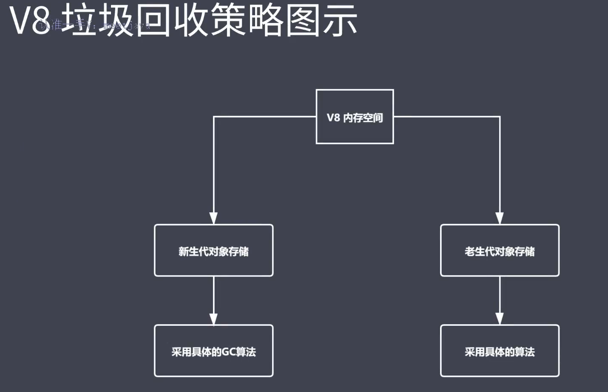
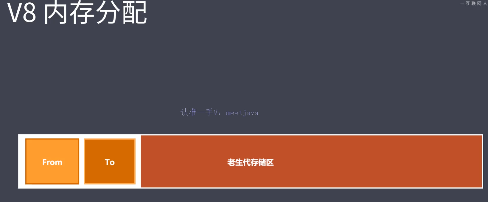
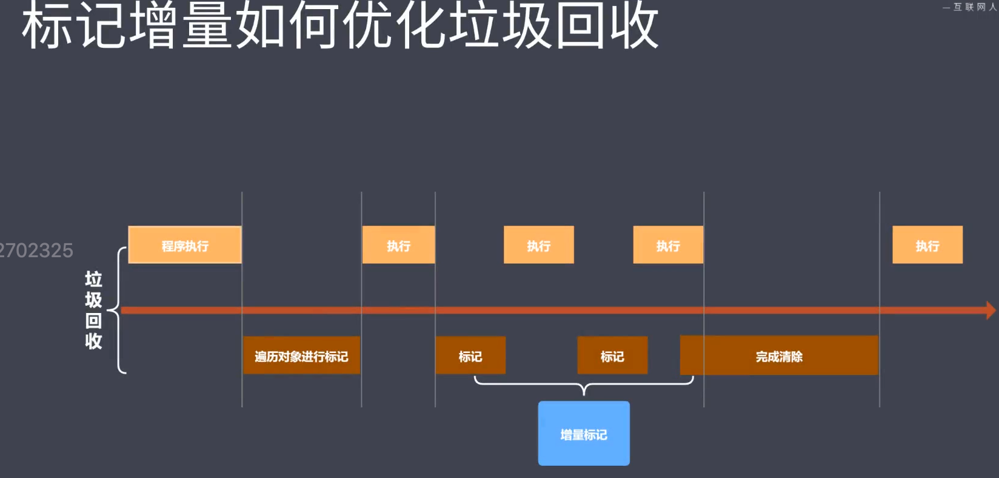
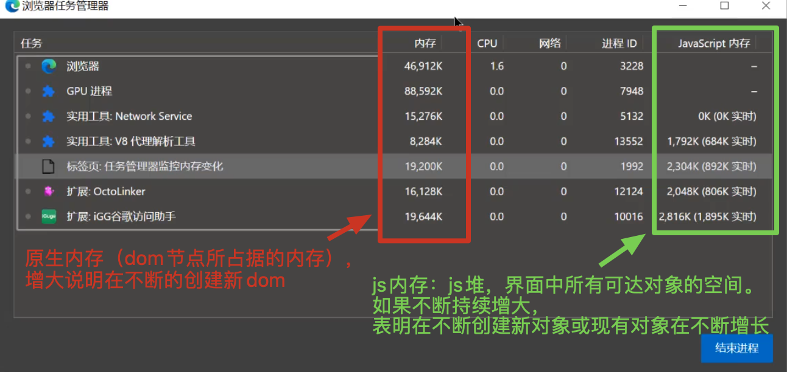
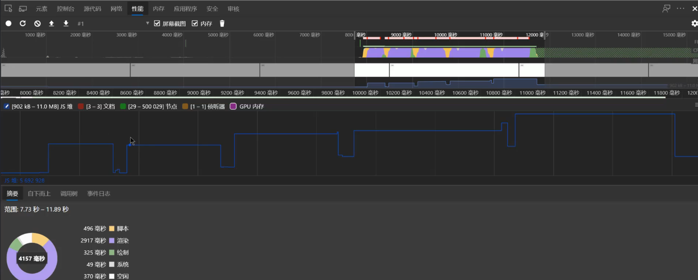
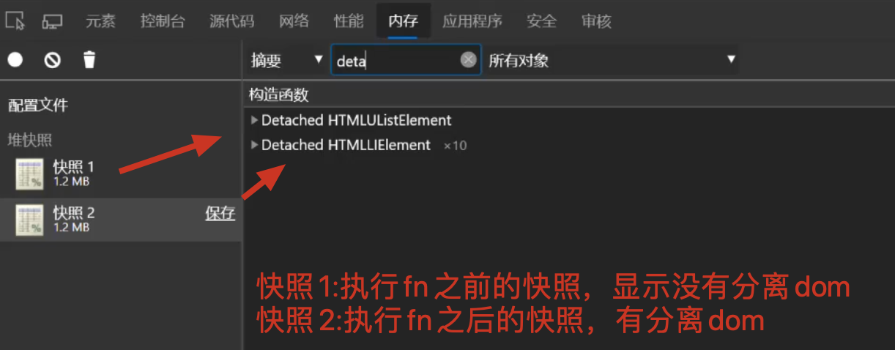

本文件夹下主要内容是：Javascript 性能优化——如何编写高性能的 Javascript，核心是 Javascript 语言的优化。

涉及内容：

- 内存管理
- 垃圾回收与常见 GC 算法
- V8 引擎的垃圾回收
- Performance 工具
- JSBench 使用

# Javascript 内存管理

## 内存管理介绍

- 内存：由可读写单元组成，表示一片可操作空间
- 管理：人为的去操作一片空间的申请、使用和释放
- 内存管理：开发者主动申请空间、使用空间、释放空间
- 管理流程：申请-使用-释放

## Javascript 中的内存管理

Javascript 跟其他语言一样，分三个步骤来管理内存：申请内存空间、使用内存空间、释放内存空间，但是 javascript 中不能像 C、或 C++一样由开发者主动去调取相应的 API 来完成空间管理，因为没有提供操作 API。但是仍然可以通过 JS 脚本演示空间的生命周期是怎样的。

简单的生命周期：

```javascript
//申请
let obj = {};
//使用
obj.name = "lg";
//释放
obj = null;
```

# Javascript 中的垃圾回收

## Javascript 中哪些被称为垃圾？

Javascript 中内存管理是自动的，即当创建了一个对象或数组或函数，就会自动的去分配相应的内存空间，在后续的代码执行过程中，如果通过一些引用关系无法找到这些对象，那么这些对象就会被看成是垃圾。或者说这些对象是已经存在的，由于代码中一些不合适的语法或结构性错误无法找到这些对象，这种对象也会被称为垃圾。

- Javascript 中内存管理是自动的
- 对象不再被引用时是垃圾
- 对象不能从根上访问到时是垃圾

## Javascript 中的可达对象

- 可以访问到的对象就是可达对象（如何访问？可以通过引用、作用域链进行访问）
- 可达的标准就是从根出发是否能够被找到
- Javascript 中的根就可以理解为是全局变量对象

## Javascript 中的引用与可达

事例 1

```javascript
let obj = { name: "xm" }; // 创建了一个对象，这个对象的引用次数为1
let ali = obj; // 对象的引用次数变为2
obj = null; // 对象的引用次数变为1,依然是可达对象
```

事例 2

```javascript
function objGroup(obj1, obj2) {
  obj1.next = obj2;
  obj2.prev = obj1;
  return {
    o1: obj1,
    o2: obj2,
  };
}
let obj = objGroup({ name: "obj1 name" }, { name: "obj2 name" });

// delete obj.o1
// delete obj.o2.prev
```

如果在代码中通过 delete 操作符取消 obj 中 o1 的引用，以及取消 obj2 中对于 o1 的引用，此时就无法找到 obj1 这个对象空间，此时 obj1 就会被认为是垃圾，Javascript 引擎就会找到这个垃圾对其进行回收。


## GC 算法

### GC 定义与作用

- GC 就是垃圾回收机制的简写
- GC 可以找到内存中的垃圾、并释放和回收空间

### GC 里的垃圾是什么

- 程序中不再需要使用的对象

```javascript
// 函数调用结束之后，不再需要name
function func() {
  name = "lg";
  return `${name} is a coder`;
}
func();
```

- 程序中不能再访问到的对象

```javascript
// 函数调用结束之后，外部访问不到name
function func() {
  const name = "lg";
  return `${name} is a coder`;
}
func();
```

### GC 算法是什么

- GC 是一种机制，垃圾回收器完成具体的工作
- 工作的内容就是查找垃圾释放空间、回收空间
- 算法就是工作时查找和回收所遵循的规则

### 常见 GC 算法

- 引用计数
- 标记清除
- 标记整理
- 分代回收

## 引用计数算法

- 核心思想：设置引用数，判断当前引用数是否为 0
- 引用计数器（由于引用计数器的存在，导致在执行效率上与其他 GC 算法有所不同）
- 引用关系改变时修改引用数字

### 实现原理

通过计算当前对象的引用计数数值，判断是否为 0，从而判定是否是垃圾

### 优缺点

优点：

- 发现垃圾时立即回收
- 最大限度减少程序暂停（应用程序在执行过程中必然会产生内存消耗，而当前执行所在的平台的内存有上限，当内存爆满时，引用算法会找到垃圾对象空间，并对其进行释放）

缺点：

- 无法回收循环引用的对象
- 时间开销大（需要时刻监听对象的引用数值）

```javascript
// 函数fn执行完毕之后，内部的局部变量obj1与obj2无法被全局访问到，应该被视为垃圾，但是由于两者相互引用了，导致无法回收
function fn() {
  const obj1 = {};
  const obj2 = {};

  obj1.name = obj2;
  obj2.name = obj1;
  return "hhhh";
}
fn();
```

## 标记清除算法

当堆中的有效内存空间(available memory)被耗尽的时候,就会停止整个程序(也被称为 stop the world),然后进行两项工作,第一项则是标记,第二项则是清除。

- 核心思想：分标记和清除两个阶段完成
- 遍历所有对象找标记活动对象
- 遍历所有对象清除没有标记对象
- 回收相应的空间



### 优缺点

优点：

- 实现简单
- 可以回收循环引用的对象

缺点：

- 内存碎片化（容易产生碎片化空间，浪费空间）。对象不移动，导致块是不连续的，
- 不会立即回收垃圾对象

## 标记整理算法

- 标记整理可以看做是标记清除的增强
- 标记阶段的操作和标记清除一致
- 清除阶段会先执行整理，移动对象位置

  
  

优缺点

- 减少碎片化空间
- 不会立即回收垃圾对象

# V8 引擎的垃圾回收

## 认识 V8

- V8 是一款主流的 Javascript 执行引擎
- V8 采用即时编译
- V8 内存设限

## V8 垃圾回收策略

- 采用分代回收的思想
- 内存分为新生代、老生代
- 针对不同对象采用不同算法



## V8 中常用 GC 算法

- 分代回收
- 空间复制
- 标记清除
- 标记整理
- 标记增量

## V8 如何回收新生代对象

### V8 内存分配

- 基于分代回收的思想，V8 内部把内存空间分为两部分，下图中左侧白色背景部分用于存放新生代对象
- 小空间用于存储新生代对象（64 位操作系统中是 32M ｜ 32 位操作系统中是 16M）
- 新生代指的是存活时间较短的对象



### 新生代对象回收

实现

- 回收过程采用复制算法+标记整理
- 新生代内存区分为二个等大小空间
- 使用空间为 From，空闲空间为 To
- 活动对象存储于 From 空间
- 标记整理后将活动对象拷贝至 To（相当于对 From 空间的对象做了备份，此时就可以执行回收操作）
- From 与 To 交换空间完成释放（释放 From 空间）

回收细节说明

- 拷贝过程中出现晋升（晋升就是将新生代对象移动至老生代），出现晋升的情况有两种：

  1. 一轮 GC 还存活的新生代需要晋升 2. To 空间的使用率超过 25%

### 老生代对象回收实现

老生代对象说明：老年代对象存放在右侧老生代区域；64 位操作系统中是 1.4G，32 位操作系统中是 700M；老生代对象就是指存活时间较长的对象

老生代对象说回收实现：

- 主要采用标记清除、标记整理、增量标记算法
- 首先使用标记清除完成垃圾空间的回收
- 采用标记整理进行空间优化
- 采用增量标记进行效率优化

### 新老生代对象回收对比

- 新生代区域垃圾回收使用空间换时间（采用的是复制算法，意味着每时每刻都有一个空闲空间的存在，但是新生代存储空间本身就很小，因此这个空闲空间也很小，因此这部分的空间浪费很小）
- 老年代区域垃圾回收不适合复制算法（原因是：老年代存储空间大，而且存储的对象比较多，复制过程中消耗的时间也会多）

增量标记优化垃圾回收：程序执行与垃圾回收交替执行



# Performance 工具

为什么使用 Performance？通过 Performance 时刻监控内存。GC 的目的是为了实现内存空间的良性循环，良性循环的基石是合理使用，时刻关注才能确定是否合理，Performance 提供多种监控方式

## performance 使用步骤：

- 打开浏览器输入目标网址
- 进入开发人员工具面板，选择性能
- 开启录制功能，访问具体界面
- 执行用户行为，一段时间后停止录制
- 分析界面中记录的内存信息

## 内存问题的外在表现

- 页面出现延迟加载或经常性暂停
- 页面持续性出现糟糕的性能
- 页面的性能随时间延长越来越差（内存泄露）

## 界定内存问题的标准

- 内存泄露：内存使用持续升高
- 内存膨胀：设备问题（当前应用本身为了达到最优效果，申请很大的内存空间，在这种情况下，可能是当前设备本身不支持）
- 频繁垃圾回收：通过内存变化图进行分析

## 监控内存的几种方式

- 浏览器任务管理器
- Timeline 时序图记录
- 堆快照查找分离 DOM
- 判断是否存在频繁的垃圾回收

### 任务管理器监控内存

假设点击了界面中的一个按钮，会生成一个很长的数组，此时可以开启浏览器自带的任务管理器

```javascript
const btn = document.getElementById("btn");
btn.onclick = function () {
  let arrList = new Array(10000000);
};
```



### Timeline 时序图记录内存

```javascript
const arrList = []
function test(){
  for(let i - 0;i<100000;i++){
    document.body.appendChild(document.createElement('p))
  }
  arrList.push(new Array(100000).join(X))
}
document.getElementById('btn').addEventListener('click', test)
```



### 堆快照查找分离 DOM

什么是分离 DOM？
在界面上看到的元素都是 DOM 节点，这些 DOM 节点本应该存活在一个 dom 树上，但是 dom 节点有两种形态：垃圾对象（脱离了 Dom 树且未有 js 对其引用的 dom 节点）与分离 dom（脱离了 Dom 树但还有 js 对其引用的 dom 节点）。分离 dom 在界面中无法看见，但是却占据了一定的内存空间。

```javascript
var tmpEle;
function fn() {
  var ul = document.createElement("ul");
  for (var i = 0; i < 10; i++) {
    var li = document.createElement("li");
    ul.appendChild(li);
  }
  tmpEle = ul;
  // 清除分离dom
  // tmpEle = null;
}
document.getElementById("btn").addEventListener("click", fn);
```



### 判断是否存在频繁的垃圾回收

为什么确定频繁垃圾回收？

- GC 工作时应用程序是停止的
- 频繁且过长的 GC 会导致应用假死
- 用户使用中感知应用卡顿

如何确定频繁的垃圾回收？

- Timeline 中频繁的上升下降
- 任务管理器中数据频繁的增加减小

# JSBench 使用

[JSBench 网站](https://jsbench.me/) 一个可以在线测试 js 代码效率的网站，
使用注意：

- 浏览器是多线程的，尽量只开一个标签页，以免被抢占资源
- run 测试时不要关掉当前线程（比如缩小当前界面），避免被挂起
- 一次测试结果不一定准确，多测试几次
