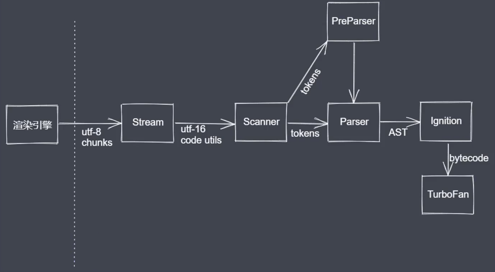
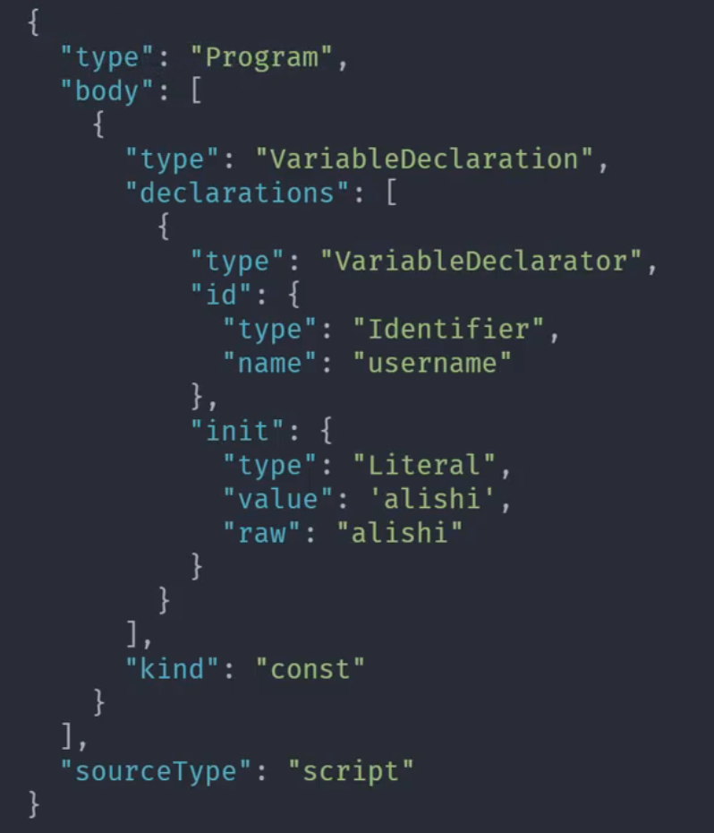
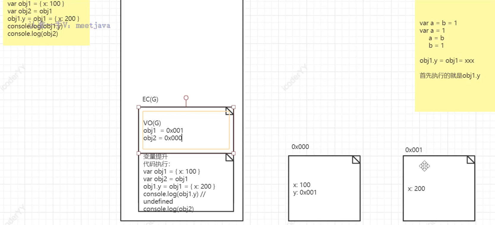
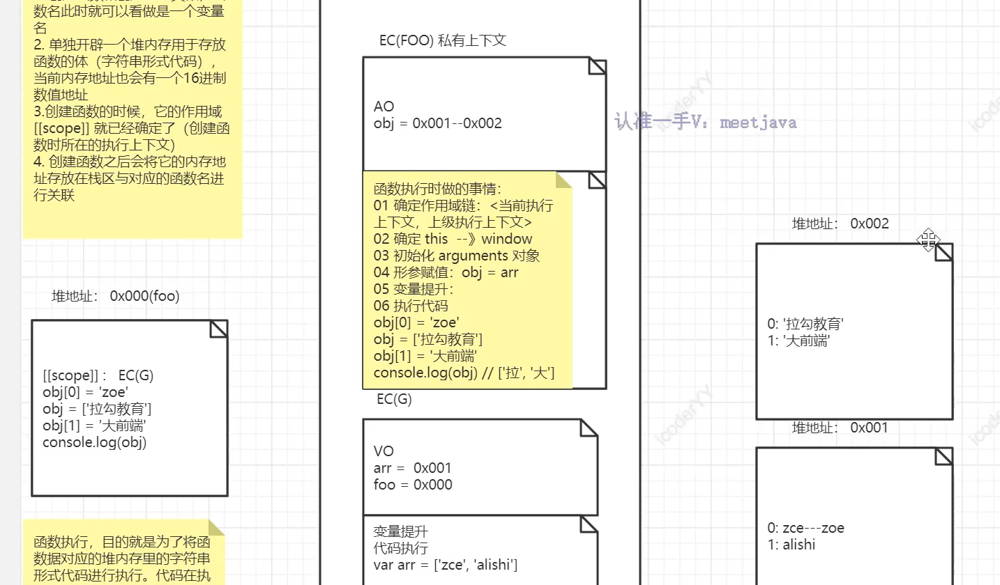

涉及内容

- V8 引擎执行流程

# V8 引擎执行流程

浏览器中存在渲染引擎，V8 是专门用来处理 js 代码的，代码执行之前是会经历一个大编译过程，而作用域和作用链在这个编译阶段就已经确定了，之后再进行词法分析、语法分析、预解析、全量解析、编译、执行、最后在堆栈层面上进行一些分析。



## scanner

scanner 是一个扫描器，对纯文本的 javascript 代码进行词法分析，把代码分析成不同的 tokens
比如定义了一个 username 变量，scanner 对其扫描之后会得到相应的 token 集合

```javascript
const username = "alishi";

// scanner对此行代码扫描之后会得到：
[
  {
    type: "Keyword",
    value: "const",
  },
  {
    type: "Identifier",
    value: "username",
  },
  {
    type: "Punctuator",
    value: "=",
  },
  {
    type: "String",
    value: "alishi",
  },
];
```

## Parser

Parser 是一个解析器，解析的过程其实是一个语法分析的过程，会把词法分析结果的 tokens 转换成抽象的语法树，并在语法分析的过程做语法校验，如果有错误则抛出错误。



Parser 的解析有两种情况：预解析与全量解析。在一般代码中会存在很多声明，但后续不被使用的情况，此时如果直接做全量解析太过浪费。

### 预解析优点

- 跳过未被使用的代码
- 不生成 AST，创建无变量引用和声明的 scopes
- 依据规范抛出特定错误
- 解析速度更快

```javascript
// 声明了两个函数，但是func1未被使用到，因此对于func1的解析过程就是预解析，但仍然会生成作用域的信息
function func1() {
  console.log("func1");
}
function func2() {
  console.log("func2");
}
func2();
```

### 全量解析

- 解析被使用的代码
- 生成 AST
- 构建具体 scopes 信息，变量引用、声明等
- 抛出所有语法错误

```javascript
// 声明时未调用，因此会被认为是不被执行的代码，进行预解析
function foo() {
  consol.log("foo");
}
// 声明时未调用，因此会被认为是不被执行的代码，进行预解析
function fn() {}

// 函数立即执行，只进行一次全量解析
(function bar() {})();

// 执行foo，那么需要重新对foo函数进行全量解析，此时foo函数被解析了两次
foo();
```

## Lgnition

Lgnition 是 V8 提供的一个解释器，也可以看作是一个预编译的过程，基于性能的考虑，预编译与编译无太大区分，因为有些代码在预编译阶段就可以直接执行。

## TurboFan

TurboFan 是 V8 提供的编译器模块

## 堆栈操作

关键词：ECStack-执行环境栈、执行上下文、VO(G)-全局变量对象、GO-全局对象

js 代码执行需要一个环境，所以在浏览器中有 js 执行引擎（比如 V8），代码最终会被转为可识别的机器码，这些字符串形式的机器码在哪执行呢？这个就轮到“执行环境栈（ECStack, execution context stack）”出场了，浏览器在渲染界面时，会在计算机的内存中开辟一片内存空间（称为执行环境栈），用来执行 js 代码，而栈内存就是执行环境栈，而不同的代码需要进行隔离，比如有两个函数，同名，但是分别位于全局和局部，如何区分代码执行呢？此时就需要提到“执行上下文”了，全局的上下文用于管理全局代码的执行，某一个私有的上下文就管理这个局部的代码执行。当前执行上下文执行完毕之后，会有一个出栈的操作，出栈之后，所存储的变量以及值会被释放，而所引用的对象是否会被释放取决于垃圾回收机制。

在全局的执行上下文中，可能同时会存在很多个变量声明，而这些变量声明都存放在全局变量对象-VO(G)所占据的空间里。

```javascript
var x = 100;
// 假设不考虑变量提升，即代码是直接执行的，那么此行代码的执行会有以下步骤：
// 1.创建一个值100，由于100是一个基本数据类型值，所以会直接存放在栈区
// 2.声明一个变量，存放在VO(g)中
// 3.建立变量与值之间的联系
```

- 基本数据类型是按值进行操作，基本数据类型值是存放在栈区的，无论是栈内存，还是后续引用数据类型会使用的堆内存，都属于计算机内存
- GO：全局对象，它并不是 VO(G)，但也是一个对象，因此它也会有一个内存的空间地址（有地址就可以对其进行访问，js 会在 VO(g)中准备一个变量 window，用于访问 GO 对象中的属性）。浏览器在渲染界面时，会在计算机的内存中申请多个内存空间，其中一个空间是用来管理 GO 的。GO 中存放了 JS 可以直接调用的 API，比如 setTimeout、setInterval，可以通过“window.\*\*”方式调用的 API 都存放在 GO 中

概念梳理：

- ESC：执行环境栈
- VO(G)：全局变量对象
- GO：全局对象
- EC(G)：全局的执行上下文

## 引用类型堆栈处理

```javascript
var a = b = 1;
// 这行代码其实执行的顺序是：
// var a = 1
// a = b 或 b = 1

var obj1.y = obj1 = { x: 200 };
// 由于运算符优先级问题，此行代码与var obj1 = obj1.y = { x: 200 } 等价，先执行obj1.y
// var obj1.y = { x: 200 };  创建了2个内存空间0x00与0x01，0x00中存放了y:0x001 ,0x001中存放了x:200；VO(G)中的obj1指向了0x000
// obj1 = { x: 200 };        VO(G)中的obj1指向了0x001
```

```javascript
var obj1 = { x: 100 }; // 此行代码执行了两个事：1.申请了一个内存空间0x000，存放了x:100 2.VO(G)中的obj1指向了0x000

var obj2 = obj1; // 2.VO(G)中的obj2指向了0x000

obj1.y = obj1 = { x: 200 };
// 1.obj1.y={ x: 200 }， 申请了一个内存空间0x001，存放了x:200；内存空间0x000中存放了x:100与y：0x001
// 2.obj1 = { x: 200 }，VO(G)中的obj1指向了0x001，内存空间0x000中存放了 x:100与y：0x001 变成了 x:100与y：0x000

console.log(obj1.y); // 输出undefined，因为上一步骤使得obj1指向了0x001，其中只有x:200
console.log(obj2); // 输出一个对象：{x: 100, y:{x:200}}
```



## 函数堆栈处理

- 变量提升阶段：创建函数和创建变量类似，函数名此时就可以看作是一个变量，存放在 VO 中，同时它的值就是当前函数对应的内存地址
- 单独开辟一个堆内存用于存放函数体（字符串形式代码），当前内存地址也会有一个 16 进制数值地址
- 创建函数时，它的作用域[[scope]]就已经确定了（创建函数时所在的执行上下文），函数本身也是一个对象，创建时会有一个内存地址，空间内存放的就是函数体代码（字符串形式的）
- 创建函数之后会将它的内存地址存放在栈区与对应的函数名进行关联
- 函数执行，目的就是为了将函数所对应的堆内存里的字符串形式代码进行执行。代码在执行时需要有一个环境，此时就意味着函数在执行时会生成一个新的执行上下文来管理函数体中的代码。（函数执行时会形成一个全新私有上下文，它里面有一个 AO 用于管理这个上下文当中的变量）
- 函数执行时做的事情：1.确定作用域链：<当前执行上下文，上级执行上下文> 2.确定 this -> window 3.初始化 arguments 对象 4.形参赋值（它就相当于是变量声明，然后将声明的变量放置于 AO） 6.变量提升 7.执行代码
- 代码执行完毕之后，会执行出栈的操作，进行内存的释放

代码示例：

```javascript
var arr = ["zce", "alishi"];

function foo(obj) {
  obj[0] = "zoe";
  obj = ["拉勾教育"];
  obj[1] = "大前端";
  console.log(obj); // 输出["拉勾教育", "大前端"]
}
foo(arr);
console.log(arr); // 输出["zce", "alishi"]

// 函数执行完成之后，会将函数执行上下文中的obj释放掉，但是这释放的是引用关系，其指向的堆内存（"拉勾教育", "大前端"）仍然存在，如果对这个堆内存还有其他引用关系，就只能交由GC释放
```



# 闭包

## 闭包堆栈处理

代码示例：

```javascript
var a = 1;
function foo() {
  var b = 200;
  return function (c) {
    console.log(c + b++);
  };
}
var f = foo();
f(5);
f(10);
```

分析（ 忽略变量提升）：

- 1.在 EC(G)-全局执行上下文里，VO 添加了 a=1
- 2.foo 函数申请了一块堆地址：0x000，存放了字符串形式的函数体，其作用域链是 EC(G),而在 EC(G)中的 VO 增加了 foo 以及 f 属性，指向 0x000 地址，
- 3.f = foo()，创建了一个函数的私有执行上下文 EC(FOO1)，其作用域链是<EC(FOO1),EC(G)>，（初始化 arguments->形参赋值这两个步骤都没有使执行上下文中的 AO 发生变化），变量提升使得 AO 增加了 b=2，代码执行返回了一个函数，使得又开辟了一个匿名函数的一个堆地址 0x001，其作用域链是 EC(FOO1)，存储了字符串形式的函数体（'console.log(c + b++);'），并将返回的这个函数赋值给了 f，使得在 EC(G)中的 VO 中的 f 指向了 0x001。当这行代码执行完毕之后，即 foo 函数执行完毕之后，应该是会进行出栈操作，即释放 EC(FOO1)上下文，并且在其内部的匿名函数堆地址 0x001 也会被释放，但是由于在 EC(G)中的 VO 中的 f 指向了 0x001，所以当前是不能够被释放的。——当前 EC(FOO1)执行上下文当中引用的一个堆地址 0x001 被 EC(G)当中的变量 f 所引用，因此 foo()调用时所创建的执行上下文不能被释放，这就形成了一个闭包的现象。
- 4.f(5)，创建了一个函数的私有执行上下文 EC(F1)，作用域链为<EC(F1),EC(FOO)>，形参赋值 c=5（使得 AO 里的 c 赋值为 5），代码执行 console.log(c + b++)，b 在上级作用域中找到为 2，因此输出为 7，b++使得 EC(FOO1)中的 b 为 3。此行代码执行完毕之后，EC(F1)会被释放，执行出栈操作。

- 5.f(10)，创建了一个函数的私有执行上下文 EC(F2)，作用域链为<EC(F2),EC(FOO)>，形参赋值 c=10（使得 AO 里的 c 赋值为 10），代码执行 console.log(c + b++)，b 在上级作用域中找到为 3，因此输出为 13，b++使得 EC(FOO1)中的 b 为 4。此行代码执行完毕之后，EC(F2)会被释放，执行出栈操作。

### 闭包总结

闭包不能够笼统的被概括为大函数返回了内部的一个函数。

- 1.闭包是一种机制，通过私有上下文来保护、保存数据的机制。

  保护-当前上下文当中的变量与其他的上下文变量互不干扰，

  保存-当前上下文中的数据（堆内存）被当前上下文以外的变量所引用，这个数据就保存下来了

  举例：函数形成的私有上下文中的私有变量跟外界的变量是互不干扰的，如果 EC(G)与 EC(FOO1)都有一个 a 变量，这两个变量是互不干扰的；函数执行完成之后，EC(FOO1)理应被释放掉，但是却保存下来了，外部还可以对其进行使用）

- 2.我们也可以认为当我们创建的某一个执行上下文不被释放的时候就形成了闭包。（函数调用形成了一个全新的私有上下文，在函数调用之后当前上下文不被释放就是闭包（临时不被释放））

## 闭包与垃圾回收 ——代码中使用了闭包，如何完成垃圾回收

```javascript
let a = 10;
function foo(a) {
  return function (b) {
    console.log(b + ++a);
  };
}

let fn = foo(10); // 0x000
fn(5); // 0x001(5) ==> 输出16
foo(6)(7); // 14
fn(20); // 0x001(20)  // 32
console.log(a); // 10

fn = null; //
foo = null; // 取消引用
```

### 代码分析

- 1.fn = foo(10).创建 EC(F001)私有执行上下文，形参赋值使得 AO 中的 a=10，作用域链为<EC(F001)， EC(G)>，返回了一个函数，开辟了一个堆地址（0x001），作用域链为 EC(F001)，而 EC(G)中的 VO 中的 fn 指向 0x001，执行完之后不会释放 EC(F001)
- 2.fn(5)，创建 EC(FN1)私有执行上下文,作用域链为<EC(FN1),EC(F001)(堆地址 0x001 的作用域链为 EC(F001))>，AO 中 b=5，执行函数是时，a 从 EC(F001)中拿到的值为 10，a 执行加一操作后进行相加，因此本行代码输入为 16；EC(F001)中的 AO 中的 a 变为 11。代码执行完毕之后，EC(FN1)会被释放。
- 3.foo(6)(7)，foo(6)创建了 EC(F002)，形参赋值使得 AO 中的 a=6，作用域链为<EC(F002)， EC(G)>，返回了一个函数，开辟了一个堆地址（0x002），作用域链为 EC(F002)；这个函数立即调用了，因此又创建了 一个匿名函数上下文 EC(FN2)，作用域链为<EC(FN2)， EC(F002)>，AO 中 b=7，输出 14，而 EC(F002)中的 AO 中的 a 变为 7，执行之后，EC(F002)、EC(FN2)、0x002 会被释放掉。
- 4.fn(20)，创建 EC(FN3)私有执行上下文,作用域链为<EC(FN3)， EC(F001)>，形参赋值-AO 中 b=20，执行代码，其中 a 在 F001 执行上下文中的值为 11，因此输出 32，而 EC(F001)中的 AO 中的 a 变为 12。执行完毕之后 EC(FN3)会被释放。
- 目前为止还未被释放的：EC(G)、EC(F001)（fn 引用了 EC(G)中创建的堆地址 0x001）、0x001。已被释放的：EC(FN1)、EC(F002)、EC(FN2)、0x002 、EC(FN3)。

### 如何释放 EC(F001)与 0x001？

```javascript
fn = null; //释放堆空间0x001
foo = null; // 释放栈空间（释放执行上下文EC(F001)）
// 关闭浏览器时，会释放EC(G)
```

- 浏览器都自有垃圾回收（内存管理，V8 为例）
- 分为两种空间：栈空间、堆空间
- 对于堆空间：当前堆内存如果被占用，就不能被释放掉，但是我们如果确认后续不再使用这个内存里的书库，也可以自己主动置空（fn=null），然后浏览器就会对其进行回收。
- 对于栈空间：当前上下文是否有内容，内容是否被其他上下文的变量所占用，如果有则无法释放（闭包）（foo=null 对其取消引用）
