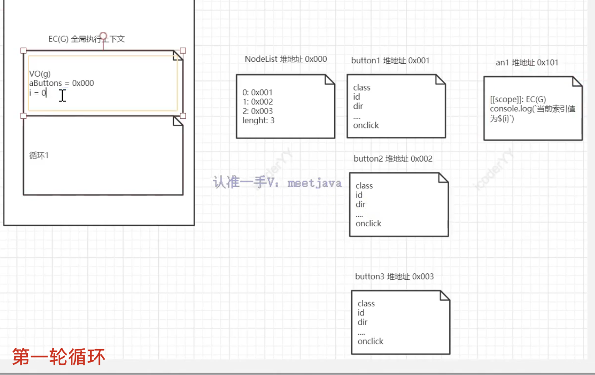

涉及内容-代码优化实例

- 循环添加事件实现

# 循环添加事件

场景：页面中有三个按钮，需要给每个按钮添加相同的点击事件。

## 基础

```javascript
// 此时点击页面中的按钮，输出的索引值都是为 aButtons.length
// 全局变量i在循环完成后已经变成了 aButtons.length，当执行点击事件时，输出的就是aButtons.length
for (var i = 0; i < aButtons.length; i++) {
  aButtons[i].onclick = function () {
    console.log(`当前索引值为${i}`);
  };
}
```

## 改正方法 1 - 使用闭包

```javascript
for (var i = 0; i < aButtons.length; i++) {
  (function (i) {
    aButtons[i].onclick = function () {
      console.log(`当前索引值为${i}`);
    };
  })(i);
}

for (var i = 0; i < aButtons.length; i++) {
  aButtons[i].onclick = (function (i) {
    return function () {
      console.log(`当前索引值为${i}`);
    };
  })(i);
}
```




## 改正方法 2 - 使用 let

```javascript
for (let i = 0; i < aButtons.length; i++) {
  aButtons[i].onclick = (function (i) {
    return function () {
      console.log(`当前索引值为${i}`);
    };
  })(i);
}
```

## 改正方法 3 - 添加自定义属性

```javascript
for (var i = 0; i < aButtons.length; i++) {
  aButtons[i].myIndex = i;
  aButtons[i].onclick = function () {
    console.log(`当前索引值为${this.myIndex}`);
  };
}
```

## 改正方法 4 - 事件委托

优点（相较于闭包）：
只有一个函数，只需要开辟一个空间:EC(G)全局执行上下文，且代码执行完毕之后会被释放。

```javascript
// html
<body>
  <button index="1">button1</button>
  <button index="2">button2</button>
  <button index="3">button3</button>
</body>;

// js
document.body.onclick=function(e){
  var target = e.target
  var targetDom = target.tagName
  if(targetDom === 'BUTTON){
    var index = target.getAttribute('index')
    console.log(`当前点击的是第${index}个`)
  }
}
```
