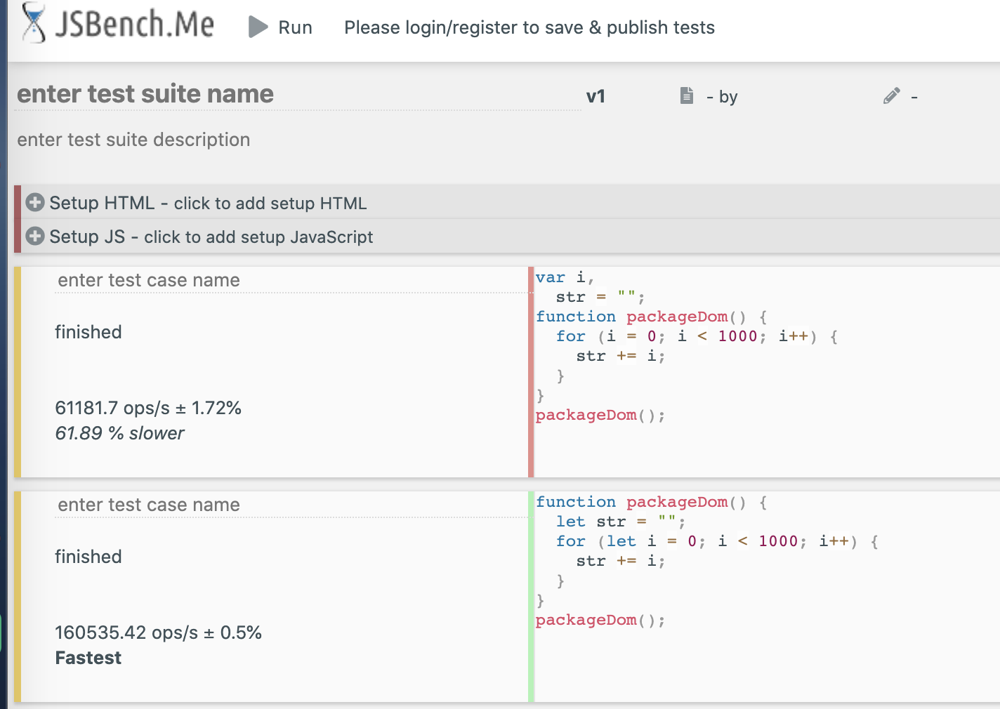
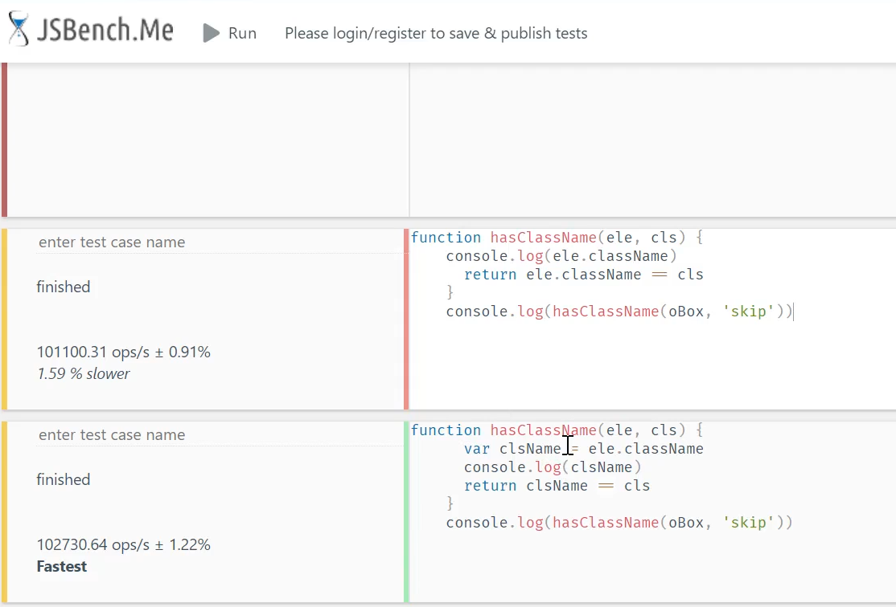
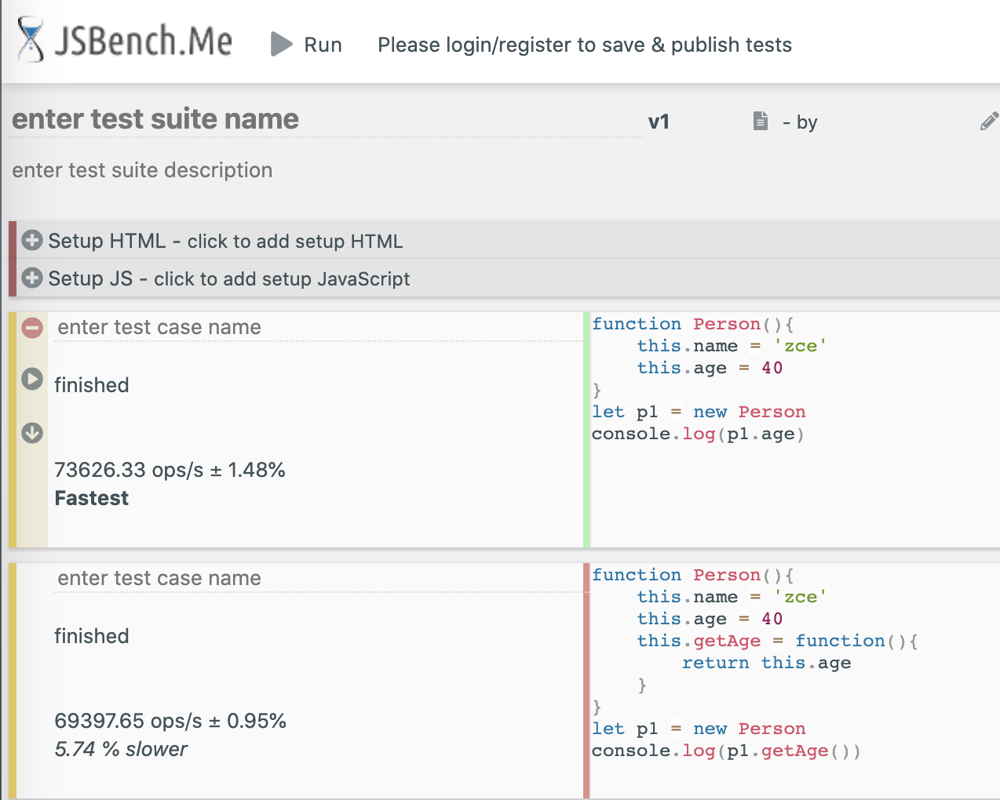
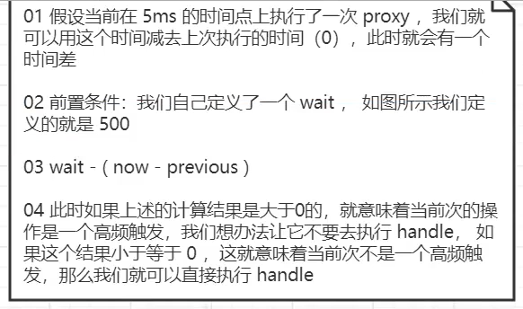

涉及内容：

- 变量局部化
- 缓存数据
- 减少访问层级
- 防抖与节流

# 变量局部化概述

变量可以保存在局部或全局，变量局部化优点是可以提高代码的执行效率（减少了数据访问时需要查找的路径）

```javascript
// 变量放在全局
var i,
  str = "";
function packageDom() {
  for (i = 0; i < 1000; i++) {
    str += i;
  }
}
packageDom();
```

```javascript
// 变量局部化
function packageDom() {
  let str = "";
  for (let i = 0; i < 1000; i++) {
    str += i;
  }
}
packageDom();
```


执行上下文分析略

# 缓存数据概述

缓存数据：对于需要多次使用的数据进行提前保存，后续进行使用。
优点：

- 减少声明和语句数（词法、语法）
- 缓存数据（作用域链查找变快）



# 减少访问层级



# 防抖与节流

为什么需要防抖与节流？在一些高频率事件触发的场景下我们不希望对应的事件处理函数多次执行

场景：

- 滚动事件
- 输入的模糊匹配
- 轮播图切换
- 点击操作
  ...

为什么会有以上情况？浏览器默认情况下都会有自己的监听事件间隔（4 ～ 6ms），如果检测到多次事件的监听执行，那么就会造成不必要的资源浪费。

举例场景：
界面上有一个按钮，我们可以连续多次点击
防抖：对于这个高频的操作来说，我们只希望识别一次点击，可以人为是第一次或者是最后一次
节流：对于高频操作，可以自己来设置频率，让本来会执行很多次的事件触发，按着我们定义的频率减少触发的次数

## 防抖

防抖函数里注意 this 与 e 的处理
核心实现（src/debounce.js 文件）：

```javascript
var oBtn = document.getElementById("btn");
// handle-最终需要执行的事件监听，wait-事件触发之后多久开始执行，immediate-控制执行第一次还是最后一次
function myDebounce(handle, wait, immediate) {
  if (typeof handle !== "function")
    throw new Error("handle must be an function");
  if (typeof wait === "undefined") wait = 300;
  if (typeof wait === "boolean") {
    immediate = wait;
    wait = 300;
  }
  if (typeof immediate !== "boolean") immediate = false;

  // 所谓的防抖效果我们想要实现的就是有一个“人”可以管理handle的执行次数
  // 如果我们想要执行最后一次，那就意味着无论我们当前点击了多少次，前面的N-1次都无用
  let timer = null;
  return function proxy(...args) {
    let self = this;
    init = immediate && !timer;
    clearTimeout(timer);
    timer = setTimeout(() => {
      timer = null;
      !immediate ? handle.call(self, ...args) : null;
    }, wait);

    // 如果当前传进来的immediate为true，就表示我们需要立即执行
    // 如果想要实现只在第一次执行，那么可以添加上timer为null作为判断，因为timer=null就意味着没有第二三..次点击
    init ? handle.call(self, ...args) : null;
  };
}
function btnClick() {
  console.log("别点击了");
}
// 当我们执行了按钮点击之后就会执行防抖函数返回的proxy
oBtn.onclick = myDebounce(btnClick, 200, false);
```

## 节流

这里的节流指的就是在自定义的一段时间内让事件进行触发。

注意事项：当在一个时间节点，浏览器判断需要执行此事件，定时器判断也应该执行此事件，也就是说 interval<=0 与!timer 两个条件同时满足了，因此这种情况下就只会走前者的逻辑，此时定时器就没有被开启，也没有被清除，后续就无法再开启定时器去执行代码了。因此需要在前者的判断条件下也要清除 timer



核心实现（src/throttle.js 文件）：

```javascript
function myThrottle(handle, wait) {
  if (typeof handle !== "function")
    throw new Error("handle must be an function");
  if (typeof wait === "undefined") wait = 400;

  let previous = 0;
  let timer = null;
  return function proxy(...args) {
    let now = new Date();
    let self = this;
    let interval = wait - (now - previous);
    if (interval <= 0) {
      clearTimeout(timer); // 此行和下一行，是为了处理当interval <= 0与!timer同时满足时的特殊情况
      timer = null;
      handle.call(self, ...args);
      previous = new Date();
    } else if (!timer) {
      setTimeout(() => {
        clearTimeout(timer);
        timer = null; //  clearTimeout(timer); 操作只是将系统中的定时器清除了，但是timer中的值还在
        handle.call(self, ...args);
        previous = new Date();
      }, interval);
    }
  };
}

function scrollFn() {
  console.log("滚动了");
}
window.onscroll = myThrottle(scrollFn, 600);
```
