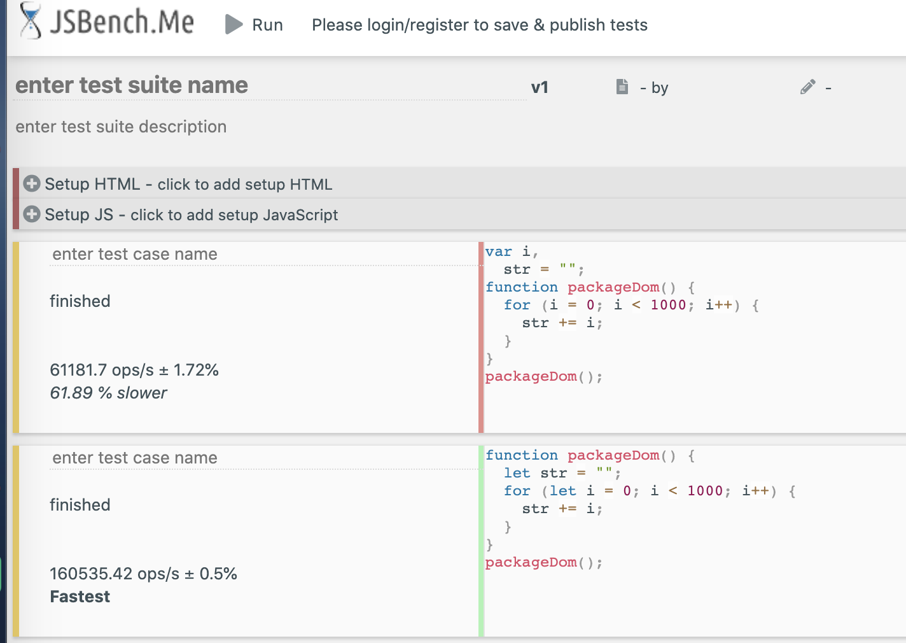

涉及内容：变量局部化

# 概述

变量可以保存在局部或全局，变量局部化优点是可以提高代码的执行效率（减少了数据访问时需要查找的路径）

```javascript
// 变量放在全局
var i,
  str = "";
function packageDom() {
  for (i = 0; i < 1000; i++) {
    str += i;
  }
}
packageDom();
```

```javascript
// 变量局部化
function packageDom() {
  let str = "";
  for (let i = 0; i < 1000; i++) {
    str += i;
  }
}
packageDom();
```


