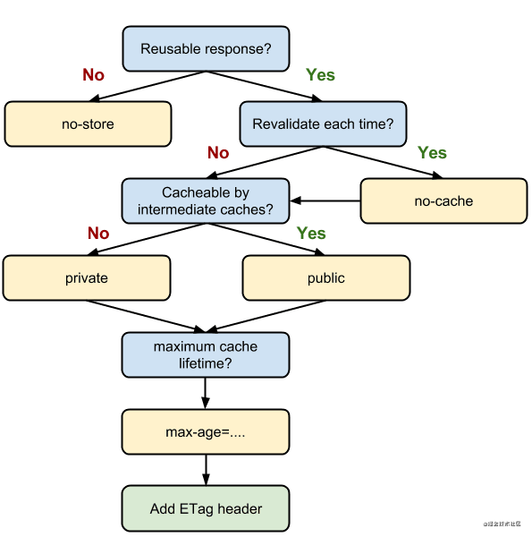
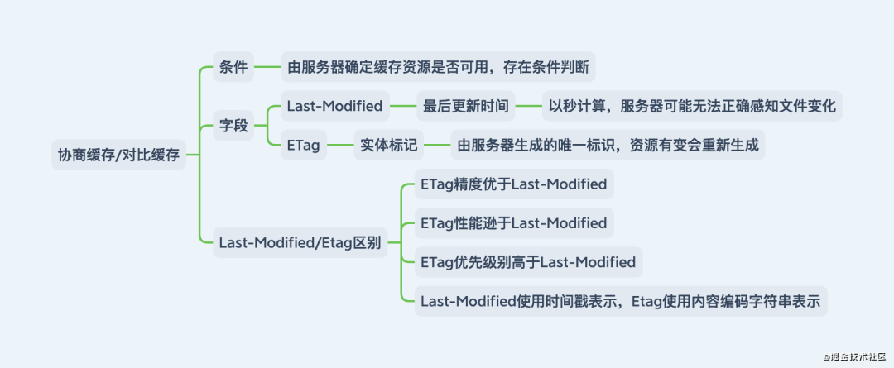

# 前言

[写给中高级前端关于性能优化的 9 大策略和 6 大指标 | 网易四年实践](https://mp.weixin.qq.com/s?__biz=Mzg2NDAzMjE5NQ==&mid=2247490527&idx=1&sn=f1ed48fe319c3a00b03a7c5c8cbe257d&chksm=ce6edf73f9195665d494d9adbbed3904ffe0ed2d244131164256f487482f315fcbbeaad4a180&scene=132#wechat_redirect)

在代码重构过程中会大量应用「性能优化」和「设计模式」两方面的知识。简单来说就是要在访问网站时使其快准狠地立马呈现在用户眼前。从过程趋势来看，性能优化可分为「网络层面」和「渲染层面」；从结果趋势来看，性能优化可分为「时间层面」和「体积层面」。所有的性能优化都围绕着两大层面两小层面实现，核心层面是网络层面和渲染层面，辅助层面是时间层面和体积层面，而辅助层面则充满在核心层面里。


这里整理出关于前端性能优化的「九大策略」和「六大指标」。

# 九大策略

网络层面——「网络层面」的性能优化，无疑是如何让资源体积更小加载更快，分为以下四方面：

- 「构建策略」：基于构建工具(Webpack/Rollup/Parcel/Esbuild/Vite/Gulp)——开发阶段
- 「图像策略」：基于图像类型(JPG/PNG/SVG/WebP/Base64)——开发阶段
- 「分发策略」：基于内容分发网络(CDN)——生产阶段
- 「缓存策略」：基于浏览器缓存(强缓存/协商缓存)——生产阶段

渲染层面——「渲染层面」的性能优化，无疑是如何让代码解析更好执行更快。渲染层面的性能优化更多表现在编码细节上，而并非实体代码。分为五方面，五方面都是编写代码时完成，充满在整个项目流程的开发阶段里：

- 「CSS 策略」：基于 CSS 规则
- 「DOM 策略」：基于 DOM 操作
- 「阻塞策略」：基于脚本加载
- 「回流重绘策略」：基于回流重绘
- 「异步更新策略」：基于异步更新

# 六大指标

将九大策略定位高于六大指标。针对九大策略还是建议在开发阶段和生产阶段接入，在项目复盘时可将六大指标的条条框框根据实际应用场景接入。六大指标基本囊括大部分性能优化细节，可作为九大策略的补充。根据每条性能优化建议的特征将指标划分为以下六方面：

- 「执行优化」：资源在执行时可做的性能优化
- 「加载优化」：资源在加载时可做的性能优化
- 「渲染优化」：资源在渲染时可做的性能优化
- 「样式优化」：样式在编码时可做的性能优化
- 「脚本优化」：脚本在编码时可做的性能优化
- 「V8 引擎优化」：针对 V8 引擎特征可做的性能优化

「性能优化」作为老生常谈的知识，必然会在工作或面试时遇上。很多时候不是想到某条性能优化建议就去做或答，而是要对这方面有一个整体认知，知道为何这样设计，这样设计的目的能达到什么效果。

# 九大策略——构建策略

说到 webpack 的性能优化，无疑是从时间层面和体积层面入手。

- 「减少打包时间」：缩减范围、缓存副本、定向搜索、提前构建、并行构建、可视结构
- 「减少打包体积」：分割代码、摇树优化、动态垫片、按需加载、作用提升、压缩资源

下面提到的构建策略都集成到笔者开源的 bruce-cli 里，它是一个「React/Vue」应用自动化构建脚手架，其零配置开箱即用的优点非常适合入门级、初中级、快速开发项目的前端同学使用，还可通过创建 brucerc.js 文件覆盖其默认配置，只需专注业务代码的编写无需关注构建代码的编写，让项目结构更简洁。

## 缩减范围——配置 includes/excludes 缩小 Loader 对文件的搜索范围，避免不必要的转译。

比如 node_modules 目录的体积这么大，没必要增加时间成本去检索所有文件。include/exclude 通常在各大 Loader 里配置，src 目录通常作为源码目录，可做如下处理。当然 include/exclude 可根据实际情况修改。

```javascript
export default {
  // ...
  module: {
    rules: [
      {
        exclude: /node_modules/,
        include: /src/,
        test: /\.js$/,
        use: "babel-loader",
      },
    ],
  },
};
```

## 缓存副本——配置 cache 缓存 Loader 对文件的编译副本，再次编译时只编译修改过的文件，未修改过的文件就不会重新编译

大部分 Loader/Plugin 都会提供一个可使用编译缓存的选项，通常包含 cache 字眼。以 babel-loader 和 eslint-webpack-plugin 为例。

```javascript
import EslintPlugin from "eslint-webpack-plugin";
export default {
  // ...
  module: {
    rules: [
      {
        test: /\.js$/,
        use: [
          {
            loader: "babel-loader",
            options: { cacheDirectory: true },
          },
        ],
      },
    ],
  },
  plugins: [new EslintPlugin({ cache: true })],
};
```

## 定向搜索——配置 resolve 提高文件的搜索速度，定向制定必须文件路径。

若某些第三方库以常规形式引入可能报错或希望程序自动索引特定类型文件都可通过该方式解决。

- alias——映射模块路径
- extensions——表明文件后缀
- noParse 过滤无依赖文件

通常配置 alias 和 extension 即可

```javascript
export default {
  // ...
  resolve: {
    alias: {
      "#": AbsPath(""), // 根目录快捷方式
      "@": AbsPath("src"), // src目录快捷方式
      swiper: "swiper/js/swiper.min.js",
    }, // 模块导入快捷方式
    extensions: [".js", ".ts", ".jsx", ".tsx", ".json", ".vue"], // import路径时文件可省略后缀名
  },
};
```

## 提前构建——配置 DllPlugin 将第三方依赖提前打包，将 DLL 与业务代码完全分离且每次只构建业务代码。

这是一个古老配置，在 webpack v2 时已存在，不过现在 webpack v4+已不推荐使用该配置，因为其版本迭代带来的性能提升足以忽略 DllPlugin 所带来的效益。

「DLL」意为动态链接库，指一个包含可由多个程序同时使用的代码库。在前端领域里可认为是另类缓存的存在，它把公共代码打包为 DLL 文件并存到硬盘里，再次打包时动态链接 DLL 文件就无需再次打包那些公共代码，从而提升构建速度，减少打包时间。

配置 DLL 总体来说相比其他配置复杂，配置流程可大致分为三步。

首先告知构建脚本哪些依赖做成 DLL 并生成 DLL 文件和 DLL 映射表文件。

```javascript
import { DefinePlugin, DllPlugin } from "webpack";

export default {
  // ...
  entry: {
    vendor: ["react", "react-dom", "react-router-dom"],
  },
  mode: "production",
  optimization: {
    splitChunks: {
      cacheGroups: {
        vendor: {
          chunks: "all",
          name: "vendor",
          test: /node_modules/,
        },
      },
    },
  },
  output: {
    filename: "[name].dll.js", // 输出路径和文件名称
    library: "[name]", // 全局变量名称：其他模块会从此变量上获取里面模块
    path: AbsPath("dist/static"), // 输出目录路径
  },
  plugins: [
    new DefinePlugin({
      "process.env.NODE_ENV": JSON.stringify("development"), // DLL模式下覆盖生产环境成开发环境(启动第三方依赖调试模式)
    }),
    new DllPlugin({
      name: "[name]", // 全局变量名称：减小搜索范围，与output.library结合使用
      path: AbsPath("dist/static/[name]-manifest.json"), // 输出目录路径
    }),
  ],
};
```

然后在 package.json 里配置执行脚本且每次构建前首先执行该脚本打包出 DLL 文件。

```javascript
{
    "scripts": {
        "dll": "webpack --config webpack.dll.js"
    }
}
```

最后链接 DLL 文件并告知 webpack 可命中的 DLL 文件让其自行读取。使用 html-webpack-tags-plugin 在打包时自动插入 DLL 文件。

```javascript
import { DllReferencePlugin } from "webpack";
import HtmlTagsPlugin from "html-webpack-tags-plugin";

export default {
  // ...
  plugins: [
    // ...
    new DllReferencePlugin({
      manifest: AbsPath("dist/static/vendor-manifest.json"), // manifest文件路径
    }),
    new HtmlTagsPlugin({
      append: false, // 在生成资源后插入
      publicPath: "/", // 使用公共路径
      tags: ["static/vendor.dll.js"], // 资源路径
    }),
  ],
};
```

为了那几秒钟的时间成本，建议配置上较好。当然也可使用 autodll-webpack-plugin 代替手动配置。

## 并行构建——配置 Thread 将 Loader 单进程转换为多进,释放 CPU 多核并发的优势

在使用 webpack 构建项目时会有大量文件需解析和处理，构建过程是计算密集型的操作，随着文件增多会使构建过程变得越慢。

运行在 Node 里的 webpack 是单线程模型，简单来说就是 webpack 待处理的任务需一件件处理，不能同一时刻处理多件任务。

文件读写与计算操作无法避免，能不能让 webpack 同一时刻处理多个任务，发挥多核 CPU 电脑的威力以提升构建速度呢？thread-loader 来帮你，根据 CPU 个数开启线程。

在此需注意一个问题，若项目文件不算多就不要使用该性能优化建议，毕竟开启多个线程也会存在性能开销。

```javascript
import Os from "os";
export default {
  // ...
  module: {
    rules: [
      {
        // ...
        test: /\.js$/,
        use: [
          {
            loader: "thread-loader",
            options: { workers: Os.cpus().length },
          },
          {
            loader: "babel-loader",
            options: { cacheDirectory: true },
          },
        ],
      },
    ],
  },
};
```

## 可视结构——配置 BundleAnalyzer 分析打包文件结构，找出导致体积过大的原因

通过分析原因得出优化方案减少构建时间。BundleAnalyzer 是 webpack 官方插件，可直观分析打包文件的模块组成部分、模块体积占比、模块包含关系、模块依赖关系、文件是否重复、压缩体积对比等可视化数据。

可使用 webpack-bundle-analyzer 配置，有了它，我们就能快速找到相关问题。

```javascript
import { BundleAnalyzerPlugin } from "webpack-bundle-analyzer";
export default {
  // ...
  plugins: [
    // ...
    BundleAnalyzerPlugin(),
  ],
};
```

## 分割代码——分割各个模块代码，提取相同部分代码，减少重复代码的出现频率

webpack v4 使用 splitChunks 替代 CommonsChunksPlugin 实现代码分割。

```javascript
export default {
  // ...
  optimization: {
    runtimeChunk: { name: "manifest" }, // 抽离WebpackRuntime函数
    splitChunks: {
      cacheGroups: {
        common: {
          minChunks: 2,
          name: "common",
          priority: 5,
          reuseExistingChunk: true, // 重用已存在代码块
          test: AbsPath("src"),
        },
        vendor: {
          chunks: "initial", // 代码分割类型
          name: "vendor", // 代码块名称
          priority: 10, // 优先级
          test: /node_modules/, // 校验文件正则表达式
        },
      }, // 缓存组
      chunks: "all", // 代码分割类型：all全部模块，async异步模块，initial入口模块
    }, // 代码块分割
  },
};
```

## 摇树优化——移除重复代码和未使用代码

摇树优化首次出现于 rollup，是 rollup 的核心概念，后来在 webpack v2 里借鉴过来使用。

摇树优化只对 ESM 规范生效，对其他模块规范失效。摇树优化针对静态结构分析，只有 import/export 才能提供静态的导入/导出功能。因此在编写业务代码时必须使用 ESM 规范才能让摇树优化移除重复代码和未使用代码。

在 webpack 里只需将打包环境设置成生产环境就能让摇树优化生效，同时业务代码使用 ESM 规范编写，使用 import 导入模块，使用 export 导出模块。

```javascript
export default {
  // ...
  mode: "production",
};
```

## 动态垫片——通过垫片服务根据 UA 返回当前浏览器代码垫片，好处是无需将繁重的代码垫片打包进去。

每次构建都配置@babel/preset-env 和 core-js 根据某些需求将 Polyfill 打包进来，这无疑又为代码体积增加了贡献。

@babel/preset-env 提供的 useBuiltIns 可按需导入 Polyfill。

- 「false」：无视 target.browsers 将所有 Polyfill 加载进来
- 「entry」：根据 target.browsers 将部分 Polyfill 加载进来(仅引入有浏览器不支持的 Polyfill，需在入口文件 import "core-js/stable")
- 「usage」：根据 target.browsers 和检测代码里 ES6 的使用情况将部分 Polyfill 加载进来(无需在入口文件 import "core-js/stable")

在此推荐大家使用动态垫片。动态垫片可根据浏览器 UserAgent 返回当前浏览器 Polyfill，其思路是根据浏览器的 UserAgent 从 browserlist 查找出当前浏览器哪些特性缺乏支持从而返回这些特性的 Polyfill。对这方面感兴趣的同学可参考 polyfill-library 和 polyfill-service 的源码。

在此提供两个动态垫片服务，可在不同浏览器里点击以下链接看看输出不同的 Polyfill。相信 IExplore 还是最多 Polyfill 的，它自豪地说：我就是我，不一样的烟火。

- 「官方 CDN 服务」：https://polyfill.io/v3/polyfill.min.js
- 「阿里 CDN 服务」：https://polyfill.alicdn.com/polyfill.min.js

使用 html-webpack-tags-plugin 在打包时自动插入动态垫片。

```javascript
import HtmlTagsPlugin from "html-webpack-tags-plugin";
export default {
  plugins: [
    new HtmlTagsPlugin({
      append: false, // 在生成资源后插入
      publicPath: false, // 使用公共路径
      tags: ["https://polyfill.alicdn.com/polyfill.min.js"], // 资源路径
    }),
  ],
};
```

## 按需加载——将路由页面/触发性功能单独打包为一个文件，使用时才加载。减轻首屏渲染的负担。

因为项目功能越多其打包体积越大，导致首屏渲染速度越慢。首屏渲染时只需对应 JS 代码而无需其他 JS 代码，所以可使用按需加载。webpack v4 提供模块按需切割加载功能，配合 import()可做到首屏渲染减包的效果，从而加快首屏渲染速度。只有当触发某些功能时才会加载当前功能的 JS 代码。

webpack v4 提供魔术注解命名切割模块，若无注解则切割出来的模块无法分辨出属于哪个业务模块，所以一般都是一个业务模块共用一个切割模块的注解名称。

```javascript
const Login = () => import(/* webpackChunkName: "login" */ "../../views/login");
const Logon = () => import(/* webpackChunkName: "logon" */ "../../views/logon");
```

运行起来控制台可能会报错，在 package.json 的 babel 相关配置里接入@babel/plugin-syntax-dynamic-import 即可。

```javascript
{
    // ...
    "babel": {
        // ...
        "plugins": [
            // ...
            "@babel/plugin-syntax-dynamic-import"
        ]
    }
}
```

## 作用提升——分析模块间依赖关系，把打包好的模块合并到一个函数中。减少函数声明和内存花销

作用提升首次出现于 rollup，是 rollup 的核心概念，后来在 webpack v3 里借鉴过来使用。

在未开启作用提升前，构建后的代码会存在大量函数闭包。由于模块依赖，通过 webpack 打包后会转换成 IIFE，大量函数闭包包裹代码会导致打包体积增大(模块越多越明显)。在运行代码时创建的函数作用域变多，从而导致更大的内存开销。

在开启作用提升后，构建后的代码会按照引入顺序放到一个函数作用域里，通过适当重命名某些变量以防止变量名冲突，从而减少函数声明和内存花销。

在 webpack 里只需将打包环境设置成生产环境就能让作用提升生效，或显式设置 concatenateModules。

```javascript
export default {
    // ...
    mode: "production"
};
// 显式设置
export default {
    // ...
    optimization: {
        // ...
        concatenateModules: true
    }
};
```

## 压缩资源——压缩 HTML/CSS/JS 代码，压缩字体/图像/音频/视频，更有效减少打包体积

极致地优化代码都有可能不及优化一个资源文件的体积更有效。

1.针对 HTML 代码，使用 html-webpack-plugin 开启压缩功能。

```javascript
import HtmlPlugin from "html-webpack-plugin";
export default {
  // ...
  plugins: [
    // ...
    HtmlPlugin({
      // ...
      minify: {
        collapseWhitespace: true,
        removeComments: true,
      }, // 压缩HTML
    }),
  ],
};
```

2.针对 CSS/JS 代码，分别使用以下插件开启压缩功能。其中 OptimizeCss 基于 cssnano 封装，Uglifyjs 和 Terser 都是 webpack 官方插件，同时需注意压缩 JS 代码需区分 ES5 和 ES6。

- optimize-css-assets-webpack-plugin：压缩 CSS 代码
- uglifyjs-webpack-plugin：压缩 ES5 版本的 JS 代码
- terser-webpack-plugin：压缩 ES6 版本的 JS 代码

```javascript
import OptimizeCssAssetsPlugin from "optimize-css-assets-webpack-plugin";
import TerserPlugin from "terser-webpack-plugin";
import UglifyjsPlugin from "uglifyjs-webpack-plugin";

const compressOpts = (type) => ({
  cache: true, // 缓存文件
  parallel: true, // 并行处理
  [`${type}Options`]: {
    beautify: false,
    compress: { drop_console: true },
  }, // 压缩配置
});
const compressCss = new OptimizeCssAssetsPlugin({
  cssProcessorOptions: {
    autoprefixer: { remove: false }, // 设置autoprefixer保留过时样式
    safe: true, // 避免cssnano重新计算z-index
  },
});
const compressJs = USE_ES6
  ? new TerserPlugin(compressOpts("terser"))
  : new UglifyjsPlugin(compressOpts("uglify"));

export default {
  // ...
  optimization: {
    // ...
    minimizer: [compressCss, compressJs], // 代码压缩
  },
};
```

3.针对字体/音频/视频文件，还真没相关 Plugin 供我们使用，就只能拜托大家在发布项目到生产服前使用对应的压缩工具处理了。针对图像文件，大部分 Loader/Plugin 封装时均使用了某些图像处理工具，而这些工具的某些功能又托管在国外服务器里，所以导致经常安装失败。

鉴于此，笔者花了一点小技巧开发了一个 Plugin 用于配合 webpack 压缩图像，详情请参考 tinyimg-webpack-plugin。

```javascript
import TinyimgPlugin from "tinyimg-webpack-plugin";
export default {
  // ...
  plugins: [
    // ...
    TinyimgPlugin(),
  ],
};
```

# 九大策略——图像策略

该策略主要围绕图像类型做相关处理，同时也是接入成本较低的性能优化策略。只需做到以下两点即可。

- 「图像选型」：了解所有图像类型的特点及其何种应用场景最合适
- 「图像压缩」：在部署到生产环境前使用工具或脚本对其压缩处理

图像选型一定要知道每种图像类型的体积/质量/兼容/请求/压缩/透明/场景等参数相对值，这样才能迅速做出判断在何种场景使用何种类型的图像。


图像压缩可在上述构建策略-压缩资源里完成，也可自行使用工具完成。由于现在大部分 webpack 图像压缩工具不是安装失败就是各种环境问题(你懂的)，所以笔者还是推荐在发布项目到生产服前使用图像压缩工具处理，这样运行稳定也不会增加打包时间。

好用的图像压缩工具无非就是以下几个：


若不想在网站里来回拖动图像文件，可使用笔者开源的图像批处理工具 img-master 代替，不仅有压缩功能，还有分组功能、标记功能和变换功能。目前笔者负责的全部项目都使用该工具处理，一直用一直爽！

图像策略也许处理一张图像就能完爆所有构建策略，因此是一种很廉价但极有效的性能优化策略。

# 九大策略——分发策略

该策略主要围绕内容分发网络做相关处理，同时也是接入成本较高的性能优化策略，需足够资金支持。

虽然接入成本较高，但大部分企业都会购买一些 CDN 服务器，所以在部署的事情上就不用过分担忧，尽管使用就好。该策略尽量遵循以下两点就能发挥 CDN 最大作用。

- 「所有静态资源走 CDN」：开发阶段确定哪些文件属于静态资源
- 「把静态资源与主页面置于不同域名下」：避免请求带上 Cookie

「内容分发网络」简称「CDN」，指一组分布在各地存储数据副本并可根据就近原则满足数据请求的服务器。其核心特征是缓存和回源，缓存是把资源复制到 CDN 服务器里，回源是资源过期/不存在就向上层服务器请求并复制到 CDN 服务器里。

使用 CDN 可降低网络拥塞，提高用户访问响应速度和命中率。构建在现有网络基础上的智能虚拟网络，依靠部署在各地服务器，通过中心平台的调度、负载均衡、内容分发等功能模块，使用户就近获取所需资源，这就是 CDN 的终极使命。

基于 CDN 的「就近原则」所带来的优点，可将网站所有静态资源全部部署到 CDN 服务器里。那静态资源包括哪些文件？通常来说就是无需服务器产生计算就能得到的资源，例如不常变化的样式文件、脚本文件和多媒体文件(字体/图像/音频/视频)等。

若需单独配置 CDN 服务器，可考虑阿里云 OSS、网易树帆 NOS 和七牛云 Kodo，当然配置起来还需购买该产品对应的 CDN 服务。由于篇幅问题，这些配置在购买后会有相关教程，可自行体会，在此就不再叙述了。

# 九大策略——缓存策略

该策略主要围绕浏览器缓存做相关处理，同时也使接入成本最低的性能优化策略。其显著减少网络传输所带来的损耗，提升网页访问速度，是一种很值得使用的性能优化策略。

通过下图可知，为了让浏览器缓存发挥最大作用，该策略尽量遵循以下五点就能发挥浏览器缓存最大作用。

- 「考虑拒绝一切缓存策略」：Cache-Control:no-store
- 「考虑资源是否每次向服务器请求」：Cache-Control:no-cache
- 「考虑资源是否被代理服务器缓存」：Cache-Control:public/private
- 「考虑资源过期时间」：Expires:t/Cache-Control:max-age=t,s-maxage=t
- 「考虑协商缓存」：Last-Modified/Etag



同时浏览器缓存也是高频面试题之一，笔者觉得上述涉及到的名词在不同语序串联下也能完全理解才能真正弄懂浏览器缓存在性能优化里起到的作用。

缓存策略通过设置 HTTP 报文实现，在形式上分为「强缓存/强制缓存」和「协商缓存/对比缓存」。为了方便对比，笔者将某些细节使用图例展示，相信你有更好的理解。




整个缓存策略机制很明了，先走强缓存，若命中失败才走协商缓存。若命中强缓存，直接使用强缓存；若未命中强缓存，发送请求到服务器检查是否命中协商缓存；若命中协商缓存，服务器返回 304 通知浏览器使用本地缓存，否则返回最新资源。

有两种较常用的应用场景值得使用缓存策略一试，当然更多应用场景都可根据项目需求制定。

- 「频繁变动资源」：设置 Cache-Control:no-cache，使浏览器每次都发送请求到服务器，配合 Last-Modified/ETag 验证资源是否有效
- 「不常变化资源」：设置 Cache-Control:max-age=31536000，对文件名哈希处理，当代码修改后生成新的文件名，当 HTML 文件引入文件名发生改变才会下载最新文件

# 九大策略——CSS 策略

- 避免出现超过三层的嵌套规则
- 避免为 ID 选择器添加多余选择器
- 避免使用标签选择器代替类选择器
- 避免使用通配选择器，只对目标节点声明规则
- 避免重复匹配重复定义，关注可继承属性

# 九大策略——DOM 策略

- 缓存 DOM 计算属性
- 避免过多 DOM 操作
- 使用 DOMFragment 缓存批量化 DOM 操作

# 九大策略——阻塞策略

- 脚本与 DOM/其它脚本的依赖关系很强：对 script 标签设置 defer
- 脚本与 DOM/其它脚本的依赖关系不强：对 script 标签设置 async

# 九大策略——回流重绘策略

- 缓存 DOM 计算属性
- 使用类合并样式，避免逐条改变样式
- 使用 display 控制 DOM 显隐，将 DOM 离线化

# 九大策略——异步更新策略

在异步任务中修改 DOM 时把其包装成微任务

# 六大指标——加载优化


# 六大指标——执行优化


# 六大指标——渲染优化


# 六大指标——样式优化


# 六大指标——脚本优化


# 六大指标——V8 引擎优化


